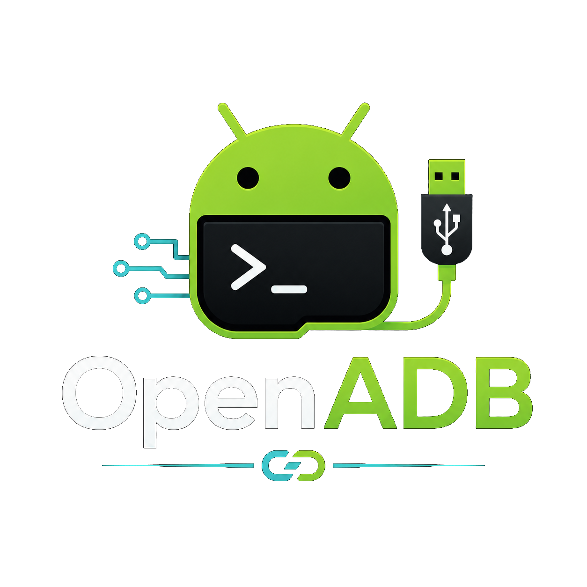
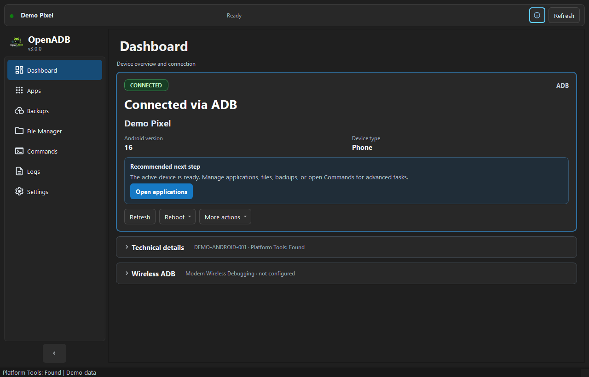
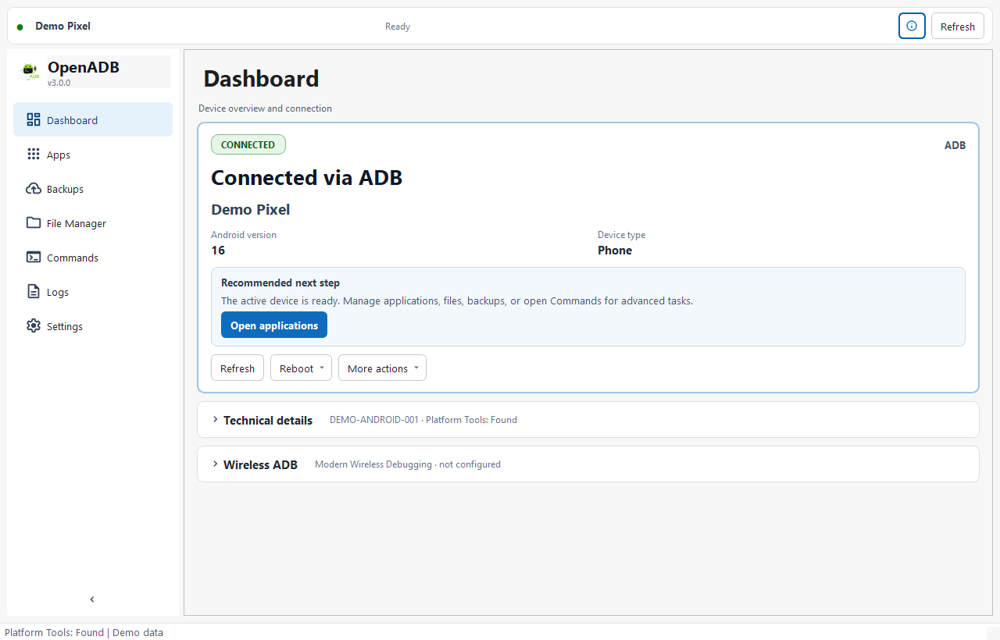
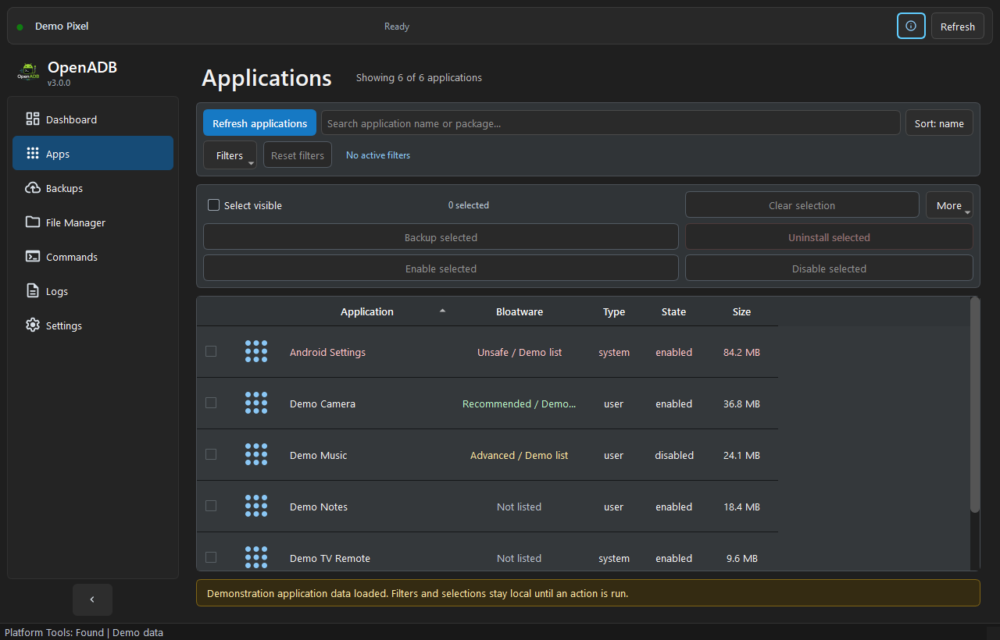
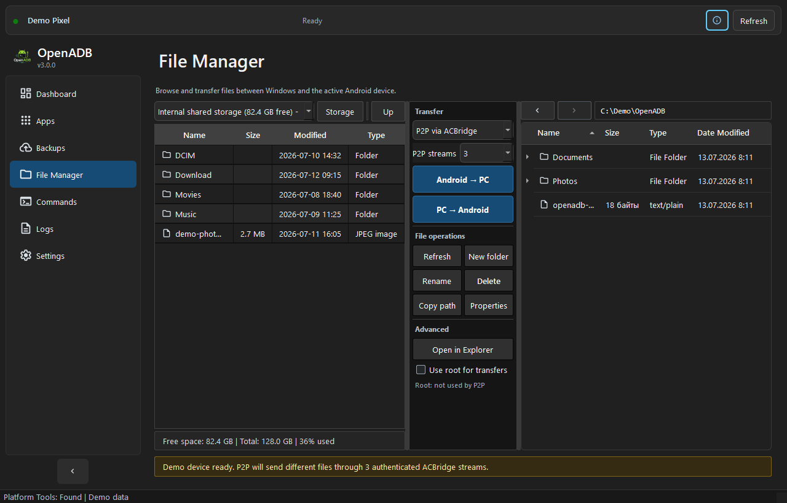
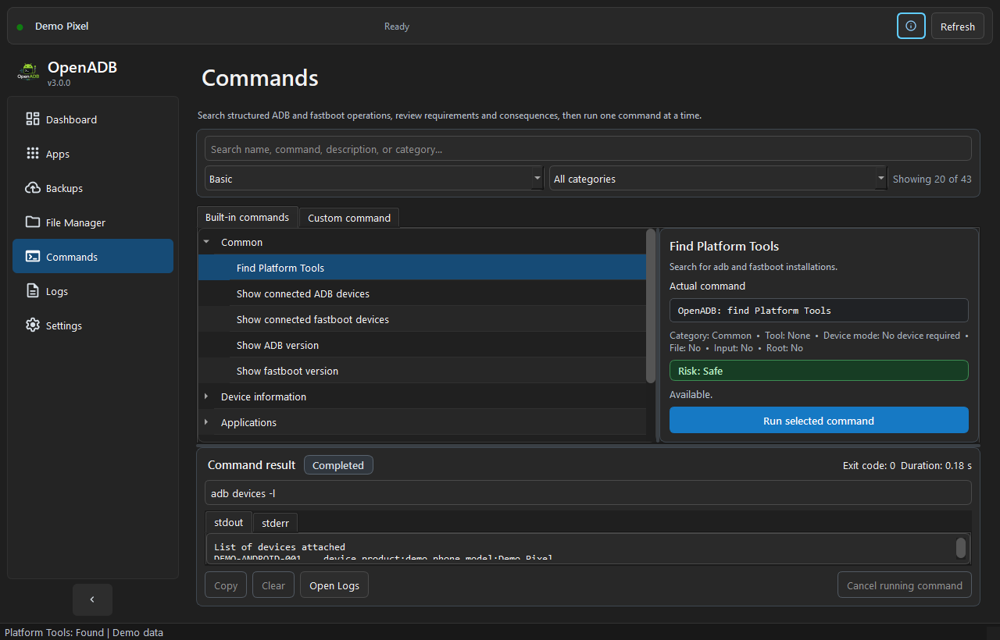
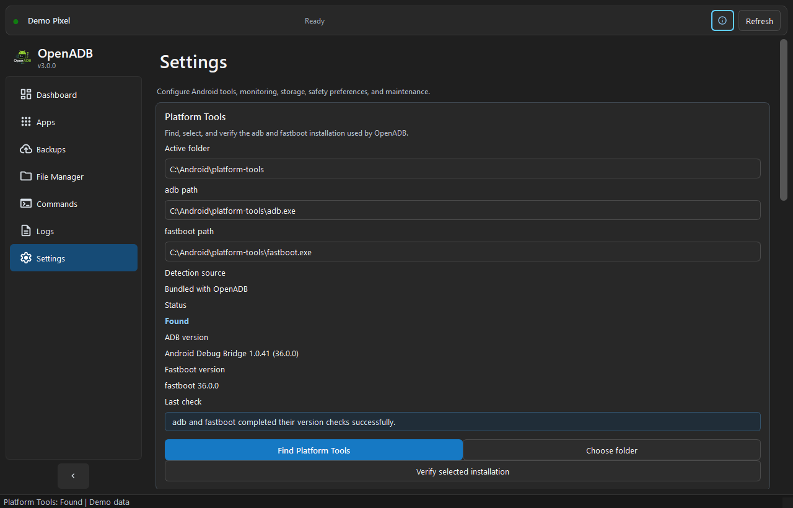

# OpenADB



Version: `3.0.0`

OpenADB is a Windows desktop GUI for Android Platform Tools. It uses ADB and fastboot directly, without MTP and without root requirements, to inspect devices, manage apps, back up APKs before uninstalling, restore backups, transfer files, run common commands, and keep useful logs.

## Interface

The main window uses the same adaptive navigation, device status bar, keyboard focus states, and Light/Dark/System theme support across all pages. The screenshots below were captured from the local application with generated demonstration data; they contain no real device serials, IP addresses, user paths, pairing codes, or logs.

### Dashboard

Dashboard keeps connection state and the recommended next action visible. Technical device information and Wireless ADB are compact, expandable sections.





### Applications

Applications combines independent type, state, and UAD-category filters while preserving selections that are temporarily hidden by search or filtering.



### File Manager

File Manager uses a resizable Android/action/Windows layout. Transfers, file operations, storage selection, optional existing-root support, and the Auto (recommended) or 1–8 manual stream selector for P2P uploads remain visible without hiding either file panel.



### Commands

Commands provides a searchable Basic/Advanced catalog, availability and risk explanations, and an inline stdout/stderr result area.



### Settings

Settings groups Platform Tools, appearance, device monitoring, application safety, root-assisted features, storage, and maintenance into scrollable sections.



## Independence and Attribution

OpenADB is an independent project. It is not affiliated with, endorsed by, sponsored by, or connected to ADB AppControl, its author, or its brand.

The author of OpenADB does not claim ownership of any ADB AppControl code, branding, name, logo, design, or other intellectual property. Any mention of ADB AppControl is only descriptive, for compatibility context or user understanding.

OpenADB uses its own package name for its optional Android bridge helper:

```text
com.communism420.acbridge
```

The bundled `ACBridge-3.0.0.apk` is an independent helper built from the source in `openadb/resources/acbridge/`. Do not use ADB AppControl branding, package identity, code, or assets as OpenADB branding.

## Acknowledgements

OpenADB was built with respect for the people and projects whose tools, code, data, or ideas helped shape it:

- Google, the Android Open Source Project, and the [Android Platform Tools](https://developer.android.com/tools/releases/platform-tools) maintainers, for ADB and fastboot.
- CyberCat and [ADB AppControl](https://adbappcontrol.com/), for product ideas around practical ADB app management, real app labels/icons through a helper bridge, and a clear user workflow for non-root Android app control. OpenADB remains an independent project and does not claim ownership of, or bundle, ADB AppControl code, branding, package identity, logo, or assets.
- T0biasCZe and [AdbFileManager](https://github.com/T0biasCZe/AdbFileManager), for the open ADB-based file-manager reference used while shaping OpenADB's two-panel File Manager, transfer workflow, and native Windows Explorer-style PC side.
- Universal-Debloater-Alliance and [Universal Android Debloater Next Generation](https://github.com/Universal-Debloater-Alliance/universal-android-debloater-next-generation), for the open Universal Debloat List data used to classify installed packages in the Apps page.
- The [PySide6 / Qt for Python](https://doc.qt.io/qtforpython-6/) maintainers, for the desktop UI framework.
- The [Pillow](https://python-pillow.org/) maintainers, for image handling used in icon and cache workflows.
- The [apkutils2](https://pypi.org/project/apkutils2/) maintainers, for APK metadata parsing used as a fallback when bridge-based app labels/icons are unavailable.

No endorsement by these projects is implied.

## Requirements

- Windows 10 or Windows 11.
- Python 3.10 through 3.14. See [dependency maintenance](docs/DEPENDENCIES.md).
- Android Platform Tools from Google.
- USB debugging enabled on the Android device for ADB features.
- Python packages from `requirements.txt`: PySide6, Pillow, `apkutils2`, `qrcode`, and `zeroconf`.

## Install Python Dependencies

```powershell
python -m pip install -r requirements.txt
```

## Install Android Platform Tools

Download Platform Tools from Google:

https://developer.android.com/tools/releases/platform-tools

Extract the archive. The extracted folder must contain `adb.exe` and `fastboot.exe`.

## How OpenADB Finds Platform Tools

OpenADB searches in this order:

1. Saved path from settings.
2. `platform-tools/` next to the program.
3. The program folder.
4. System `PATH`.
5. User `PATH`.
6. Typical folders:
   - `C:/platform-tools/`
   - `C:/Android/platform-tools/`
   - `C:/Program Files/Android/platform-tools/`
   - `C:/Users/<user>/AppData/Local/Android/Sdk/platform-tools/`
   - `C:/Users/<user>/platform-tools/`

If several valid folders are found, OpenADB shows a picker with path, ADB version, fastboot version, and source. You can change the active folder in `Settings`.

To add Platform Tools to `PATH`, add the folder containing `adb.exe` to your Windows user environment variable `Path`, then restart OpenADB.

## Run

Recommended on Windows:

```powershell
OpenADB.bat
```

Or from a terminal:

```powershell
python -m openadb.main
```

or:

```powershell
python openadb/main.py
```

### First-run checklist

1. Install the Python dependencies with `python -m pip install -r requirements.txt`.
2. Download and extract Android Platform Tools, or place `platform-tools/` next to OpenADB.
3. Start `OpenADB.bat`.
4. If adb and fastboot are not found, open `Settings -> Platform Tools` and use `Find Platform Tools` or `Choose folder`, then verify the selected installation.
5. Enable USB debugging, connect the device, and accept the RSA fingerprint prompt on Android.

OpenADB can be explored without a connected device. Device-dependent buttons remain disabled and explain what connection mode or tool is required.

## USB Debugging

On the phone:

1. Open Android Settings.
2. Enable Developer options.
3. Enable USB debugging.
4. Connect USB.
5. Confirm the RSA fingerprint prompt.

If OpenADB shows `ADB unauthorized`, unlock the phone and confirm the RSA prompt. If the prompt does not appear, reconnect USB, revoke USB debugging authorizations on the phone, or run `adb kill-server` and `adb start-server`.

## Wireless ADB

OpenADB can connect to a device over Wi-Fi directly from the `Dashboard`.

Wireless ADB is a compact, expandable Dashboard section with three separate scenarios:

- `Modern Wireless Debugging`: Android 11+ QR pairing, pairing-code dialog, mDNS discovery, and an explicit connection port.
- `Legacy TCP/IP`: the older `adb tcpip 5555` workflow. The UI asks only for the device IP address and uses port `5555` internally.
- `Android TV`: manual host/port connection plus mDNS discovery through `Find Android TV`.

Only controls relevant to the selected scenario are shown. Each scenario stores its own host and connection settings in the current phone/TV profile. Pairing ports may be retained for convenience, but pairing codes and QR passwords are never saved.

Legacy TCP/IP IP-only workflow:

1. Connect the phone by USB and confirm that ADB works.
2. Keep the phone and PC on the same Wi-Fi network.
3. Expand `Dashboard -> Wireless ADB` and choose `Legacy TCP/IP`.
4. Press `Enable TCP/IP over USB` while USB is still connected.
5. Use `Find device Wi-Fi IP`, enter or confirm the IP address, then press `Connect by IP`.
6. After the wireless device appears in the status bar, the USB cable can usually be disconnected.

Android 11+ Wireless debugging workflow:

1. Enable `Developer options -> Wireless debugging` on the phone.
2. In `Dashboard -> Wireless ADB`, choose `Modern Wireless Debugging`.
3. For QR pairing, press `Pair by QR code`.
4. On the phone, choose `Pair device with QR code` and scan the QR code shown by OpenADB.
5. OpenADB waits for the Android mDNS pairing service, runs `adb pair`, then tries to find the wireless connect service and run `adb connect` automatically.

QR pairing discovery uses both Platform Tools `adb mdns services` and the Python `zeroconf` fallback. If the phone stays on `Pairing device...`, check that the PC and phone are on the same Wi-Fi network, Windows Firewall allows local/private-network traffic, and the router does not block mDNS, multicast, or client-to-client LAN traffic.

Android 11+ pairing-code workflow:

1. Enable `Developer options -> Wireless debugging` on the phone.
2. Choose `Pair device with pairing code`.
3. Choose `Modern Wireless Debugging` in `Dashboard -> Wireless ADB` and press `Pair with code…`.
4. Enter the phone IP, pairing port, and temporary pairing code in the dialog.
5. Press `Pair`, then enter the separate Wireless debugging connection port and press `Connect`.

Android TV workflow:

1. On the TV, enable `Developer options`.
2. Enable `Network debugging`, `ADB debugging over network`, or Android 11+ `Wireless debugging` depending on the TV firmware.
3. Choose `Android TV` in `Dashboard -> Wireless ADB`.
4. If the TV exposes an IP address and port, enter them and press `Connect to TV`.
5. Otherwise press `Find Android TV`. OpenADB scans mDNS for `_adb-tls-connect._tcp`, lets you choose the discovered TV if there are several, and runs `adb connect`.
6. If the TV requires pairing first, use the separate pairing-code dialog or QR pairing when supported by the firmware.

OpenADB uses the real Platform Tools commands `adb tcpip`, `adb mdns services`, `adb pair`, `adb connect`, and `adb disconnect`.

## Dashboard

Dashboard puts the textual connection state, active device, ADB/Recovery/Fastboot mode, Android version, device type, and recommended next action first. `Technical details` contains the serial, manufacturer, SDK, ADB and fastboot versions, and active Platform Tools path. The primary row contains `Refresh`, a reboot menu, and `More actions`; less common device-list commands remain available in the menus.

## Apps

Apps lists installed packages with checkbox, icon or fallback icon, label/package name, type, state, version, APK paths, and size when Android allows it.

For faster real labels and rendered application icons, OpenADB automatically installs and starts its own helper APK, `com.communism420.acbridge`, from `openadb/resources/acbridge/ACBridge-3.0.0.apk`. The helper exports app labels and PNG icons through ADB-readable files, then OpenADB caches them locally. If the helper cannot be installed or started, OpenADB falls back to APK metadata parsing and clearly reports that fallback in the Apps status line.

ACBridge 3.0.0 (`versionCode 30002`) exports only the packages OpenADB asks for, reports live label/icon progress, exports versionName/versionCode and APK size through Android PackageManager, stores pre-rendered PNG icons without extra ZIP recompression, and OpenADB imports those PNGs directly into the icon cache. Like ADB AppControl's bridge workflow, OpenADB exchanges compact cache files instead of pulling hundreds of APK files. On phones it keeps the public `/sdcard/.adac` exchange folder for compatibility; on Android TV it is packaged as a leanback-compatible helper and prefers its app-specific external folder first, because some TV firmwares restrict public hidden folders more aggressively.

OpenADB does not automatically delete an installed ACBridge package. If Android reports a signature mismatch while updating ACBridge, OpenADB keeps the existing helper and explains the issue. To move from an older manually built/debug-signed ACBridge to the bundled helper, uninstall `com.communism420.acbridge` manually and refresh Apps again.

OpenADB also loads per-package version metadata in parallel with a bounded worker pool. The default limit is `apps_metadata_parallelism: 6` in `settings.json`; raising it too high can make ADB slower or less stable on some devices.

OpenADB includes a local snapshot of the Universal Android Debloater Next Generation Universal Debloat List:

https://github.com/Universal-Debloater-Alliance/universal-android-debloater-next-generation/blob/main/resources/assets/uad_lists.json

The database is GPL-3.0 data from the Universal-Debloater-Alliance project. OpenADB uses it only to classify installed package names in the Apps table as `Recommended`, `Advanced`, `Expert`, `Unsafe`, or `Not listed`. `Unsafe` means the package is known to UAD but should not be removed casually.

The compact filter menu has three independent dimensions that can be combined: `All/User/System`, `Any/Enabled/Disabled`, and `Any/Recommended/Advanced/Expert/Unsafe/Not listed`. Search matches both the displayed application name and package name. Sorting by name or size and checkbox selections are preserved while filters change.

Supported actions:

- Refresh apps.
- Search, combine filters, reset filters, and sort by name or size.
- Select all visible rows, keep hidden selections, or clear the complete selection.
- Back up selected apps.
- Uninstall selected apps.
- Disable or enable selected apps.
- Run `cmd package install-existing` from `More`.
- Export package list to CSV.

Before uninstalling, OpenADB creates an APK backup by default. If backup fails, uninstall is skipped for that app. Split APK packages are backed up by saving every APK path returned by `pm path`. Restore uses `adb install` for one APK and `adb install-multiple` for split APK backups.

System apps are removed only for Android user 0 with:

```text
pm uninstall --user 0 package.name
```

They can often be restored with:

```text
cmd package install-existing package.name
```

Critical packages such as System UI, Settings, Google Play services, package installer, permission controller, media/settings providers, launcher, shell, and keyboard are highlighted and require extra confirmation.

## Backups

Backups are stored as:

```text
<OpenADB data>/backups/package.name/date_time/
```

Each backup contains APK files, `metadata.json`, optional `icon.png`, and `command_log.txt`.

The Backups tab can refresh backups, restore selected backup, delete backup, open the backup folder, show metadata, and install APK files from backup.

## File Manager

The File Manager has a resizable three-part splitter:

- Left: Android filesystem through ADB only.
- Center: transfer transport, file-operation, Explorer, and root-assisted controls.
- Right: Windows filesystem with native Explorer integration when available and a Qt fallback.

Android listing uses `adb shell`. For a new device profile, the default transfer transport is Platform Tools (ADB) and uses:

```text
adb pull
adb push
```

ADB remains the default upload transport for a new device profile. For PC → Android uploads, the transport selector can instead use `P2P via ACBridge`. On the first unacknowledged P2P selection for each device profile, OpenADB explains that the connection is authenticated and file integrity is verified, but the file data is not encrypted. Accepting the warning suppresses repeats for the current run; selecting `Do not show this warning again` persists the acknowledgement only in that profile. Cancelling the warning keeps or restores ADB. While P2P is selected, the compact `Authenticated, not encrypted` status remains visible. Use P2P only on a trusted private network, never on public, shared, guest, or otherwise untrusted Wi-Fi.

P2P parallelism defaults to `Auto (recommended)`. Its deterministic planner selects 1–4 streams from the captured file count, total size, average size, and largest-file share. It does not probe, benchmark, or guess device or network speed. A per-profile manual override offers 1–8 streams; the actual count never exceeds the number of files, so a single file always uses one stream. OpenADB balances files between independent sessions by size and includes directory entries in those sessions; ACBridge serializes directory creation across concurrent sessions and keeps every individual file atomic. Platform Tools remains the control plane: OpenADB installs/updates the security-hardened ACBridge 3.0.0 build 2 (`versionCode 30002`), streams a one-shot authenticated request through ADB `run-as` standard input into ACBridge private app storage, starts short-lived foreground sessions, and retrieves their generated session keys. The request ID is only a public locator for request-scoped control files: the bootstrap secret stays inside the streamed payload, and the generated session key is returned only in authenticated `READY` metadata. On the first transfer to a MicroSD/USB location, ACBridge pauses in `PERMISSION_REQUIRED`, opens its Android storage-access flow, and waits for the user to approve the requested SAF tree or Android's `All files access` fallback. A P2P server does not open its TCP port and no file bytes are sent before that permission is available. File bytes then travel directly from the PC to the Android device over the local network. ACBridge writes them through the granted SAF tree, or through the granted storage-manager access on TV firmware without a working folder picker, so removable MicroSD/USB storage can be written without root even when the Android `shell` user is blocked. Android → PC transfers continue through Platform Tools in this version.

Each P2P session accepts one authenticated connection, and ACBridge can keep several selected sessions active concurrently. The foreground service stops only after every session has finished or timed out. Session keys are never placed in an ADB command line, and their authenticated `READY` status files are removed before data transfer. HMAC-SHA256 authenticates the connection, every entry-metadata control frame, the canonical request transcript, each file payload, and the terminal success response with exact entry/file/byte counts. SHA-256 verifies each completed file before ACBridge replaces an existing destination. Partial files use temporary SAF documents and are removed after cancellation or failure. These checks authenticate the one-shot session and verify integrity; they do not encrypt the file data. Use P2P only on a trusted private network. Router/AP client isolation and host firewalls can prevent the PC from reaching the TV directly.

MTP is not used. Drag and drop works in both directions, transfers show progress and support cancellation, and the splitter position, last paths, upload transport, and P2P stream preference are saved per device profile. The optional P2P warning acknowledgement is also profile-local. `F5`, `F2`, `Delete`, `Enter`, and `Backspace` provide common keyboard operations when a file panel has focus. Android protected paths show a warning because non-root ADB usually cannot write to system partitions.

For Android TV and TV boxes, the Android side includes a storage-volume selector. OpenADB detects internal shared storage and removable public volumes reported by Android, including MicroSD/USB storage mounted as:

```text
/storage/<UUID>
```

When `Use root for transfers` is explicitly enabled and root is already granted by the device, OpenADB can also show root-only removable-media paths such as:

```text
/mnt/media_rw/<UUID>
```

File creation, deletion, rename, pull, and the default push transport work through ADB on the selected storage volume. If P2P upload or ACBridge deletion needs removable-storage access, OpenADB asks ACBridge to request Android Storage Access Framework access on the TV screen. Select the requested MicroSD/USB storage location once; Android persists that permission, and future P2P uploads and deletes can use `DocumentsContract` through ACBridge without MTP. ACBridge 3.0.0 opens the picker for the matching storage volume when Android exposes it, resolves files by traversing the granted SAF tree, and falls back to Android's All files access settings for OpenADB Bridge if the firmware has no system folder picker. If Android still denies write access, OpenADB reports the error instead of silently pretending the operation succeeded.

## Commands

The Commands page provides a searchable command catalog with `Basic` and `Advanced` views and category filters. Selecting a command shows the exact command, required tool and device mode, file/input/root requirements, availability reason, risk level, and consequence before it can run. A separate Custom command tab accepts only commands beginning with `adb` or `fastboot` and keeps local command history.

Only one command worker can run at a time. Results stay inside the page with the command text, status, exit code, duration, stdout, stderr, Copy, Clear, Cancel, and Open Logs controls.

Commands that need files open a Windows file picker. Commands that need a package name open an input dialog. Risk is derived from the actual command after input is applied. Destructive and critical operations require explicit confirmation, including typed confirmation for the highest-risk erase, format, flash, and bootloader operations.

## Logs

OpenADB logs:

- Time.
- Full command.
- stdout.
- stderr.
- exit code.
- duration.
- human-readable status.

The Logs tab can clear the visible log, save it, copy it, and open the logs folder. Technical details are kept in log files.

## Settings

Settings are stored in JSON under the Windows user profile:

```text
C:/Users/<user>/OpenADB/
```

If older data exists in `%APPDATA%/OpenADB/` or the former portable `OpenADB-data/` folder, OpenADB migrates it into `C:/Users/<user>/OpenADB/` on startup.

When a phone is detected, OpenADB switches to a per-phone profile under:

```text
C:/Users/<user>/OpenADB/Phones/<device-serial>/
```

When an Android TV or TV box is detected, OpenADB stores the same kind of profile under:

```text
C:/Users/<user>/OpenADB/TVs/<device-serial>/
```

Each profile contains its own `settings.json`, `backups/`, `temp/`, `logs/`, `app-cache/`, `icon-cache/`, APK metadata cache, ACBridge temporary files, and app backup folders. This keeps settings, app data, icons, logs, temporary files, and backups separated between different phones and TVs. Older profiles from the previous `devices/<device-serial>/` layout are migrated into `Phones/` or `TVs/` the next time that device is activated.

The scrollable Settings page has seven sections: Platform Tools, Appearance, Device monitoring, Applications and backups, Root and advanced features, Storage paths, and Maintenance. Platform Tools discovery, manual folder selection, and verification are separate actions. Maintenance can reset only UI state or, after confirmation, reset settings and caches while preserving APK backup folders.

Settings include:

- platform-tools folder and versions.
- backups, temp, and logs folders.
- theme: System, Light, Dark.
- auto-refresh device status and interval.
- show system apps.
- show warnings.
- require backup before uninstall.
- last Wireless ADB host and ports for the current profile.
- clear icon cache.
- clear temporary files.

Root-assisted features use only `su`/root access that already exists and is granted on the connected device. OpenADB does not root a device, install root, unlock the bootloader, bypass Android permissions, or guarantee access to protected paths. When root is unavailable, supported operations fall back to normal ADB or report that the action is unavailable.

## Safety Notes

Fastboot unlock/lock can wipe all user data. Fastboot boot/flash/erase/format can make a device unbootable or permanently lose data if the image, partition, or device is wrong. ADB sideload, uninstall, package disable, and root commands can also change device state. OpenADB blocks unavailable commands and asks for confirmation—plus typed confirmation for the highest-risk operations—but you are responsible for verifying the active device and understanding the exact command before running it.
