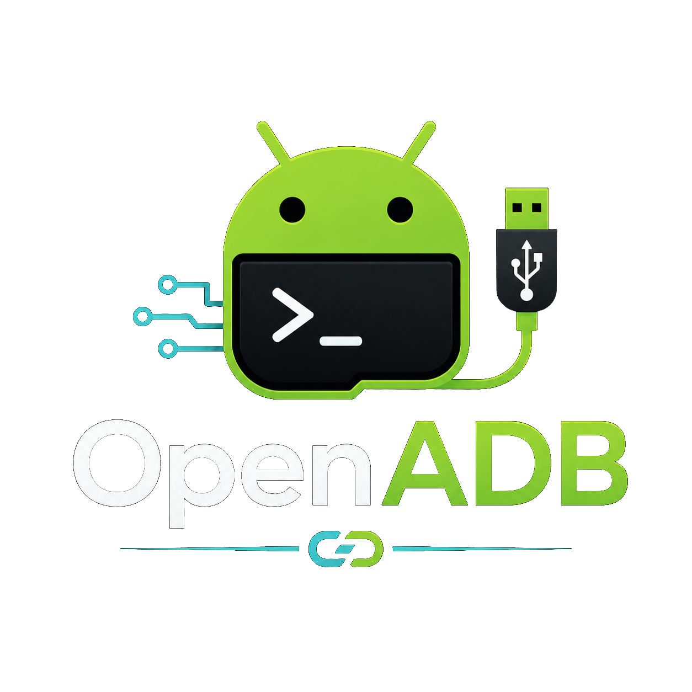
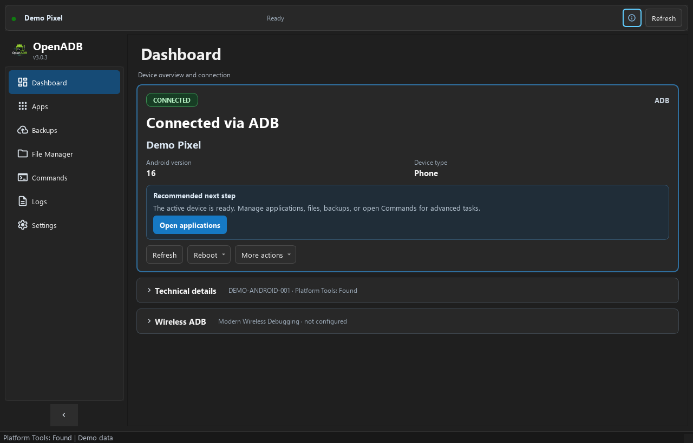
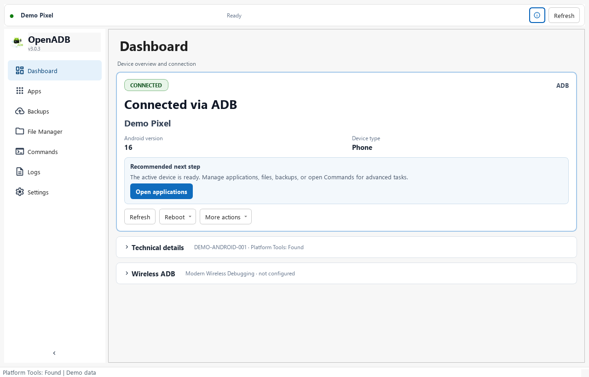
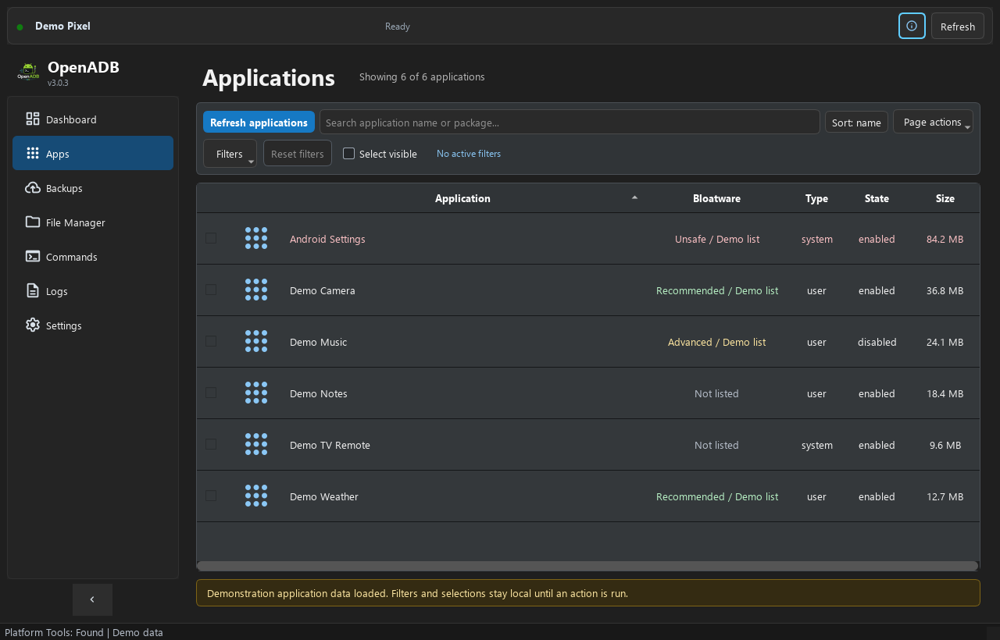
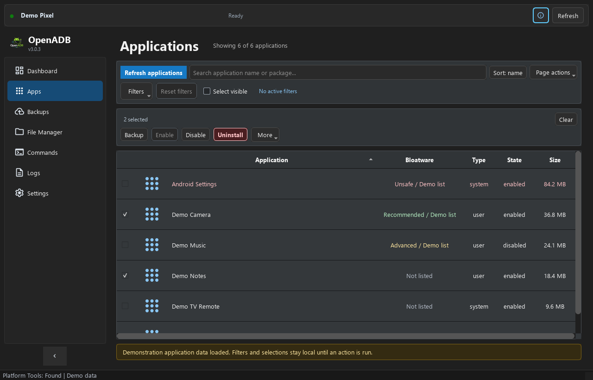
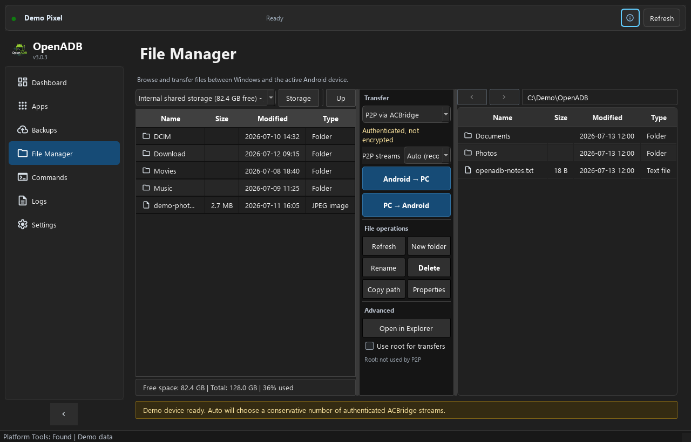
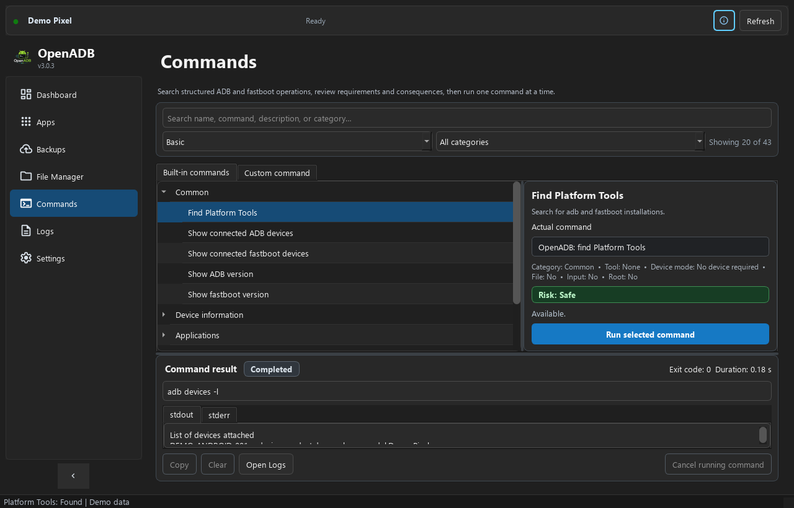
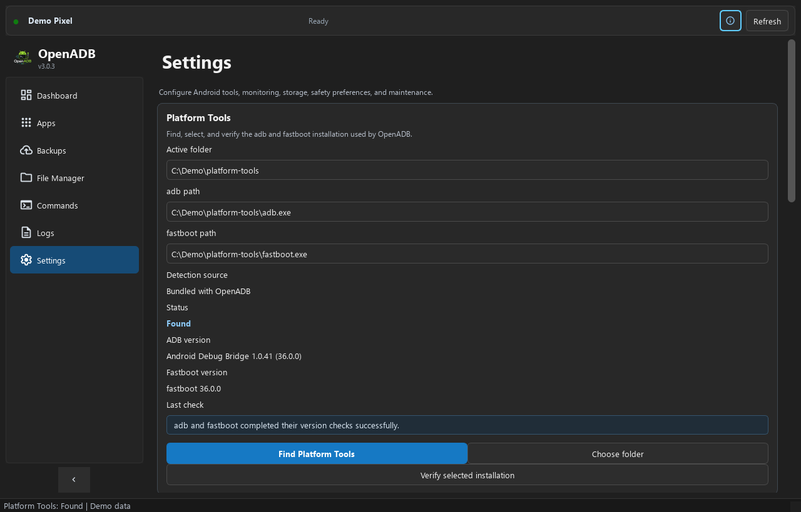

# OpenADB



Version: `3.1.0`

OpenADB is a Windows desktop GUI for Android Platform Tools. It uses ADB and fastboot directly, without MTP and without root requirements, to inspect devices, manage apps, back up APKs before uninstalling, restore backups, transfer files, run common commands, and keep useful logs.

OpenADB's original source code, including ACBridge, is free software licensed
under the [GNU General Public License, version 3 or later](LICENSE). Bundled
third-party software, data, and artwork retain their respective licenses.

## Downloads

Download the current Windows build from the
[GitHub Releases page](https://github.com/communism420/OpenADB/releases/latest).
The release also provides `SHA256SUMS.txt` and `BUILD_STATUS.json`; verify both
before running the executable. OpenADB is portable and does not require a
Windows installer.

Artifact names communicate signing state:

- `OpenADB-<version>.exe` is permitted only after Authenticode signing and
  independent signature verification succeed.
- `OpenADB-<version>-unsigned.exe` is intentionally unsigned and has no
  authenticated Windows publisher identity.

Do not infer trust from an older filename. Verify the downloaded file itself:

```powershell
$files = @(Get-ChildItem .\OpenADB-<version>*.exe)
if ($files.Count -ne 1) { throw "Expected exactly one OpenADB executable." }

$exe = $files[0]
$status = Get-Content .\BUILD_STATUS.json -Raw | ConvertFrom-Json
$sha256 = (Get-FileHash $exe.FullName -Algorithm SHA256).Hash.ToLowerInvariant()
$statusHash = ([string]$status.sha256).ToLowerInvariant()

if ($status.filename -ne $exe.Name -or $statusHash -ne $sha256) {
    throw "BUILD_STATUS.json does not match the executable."
}

$checksumLine = Get-Content .\SHA256SUMS.txt |
    Where-Object { $_ -match [regex]::Escape($exe.Name) } |
    Select-Object -First 1
if (-not $checksumLine -or $checksumLine.Split()[0].ToLowerInvariant() -ne $sha256) {
    throw "SHA256SUMS.txt does not match the executable."
}

$signature = Get-AuthenticodeSignature $exe.FullName
$isValidlySigned = $signature.Status -eq 'Valid'
if ([bool]$status.signed -ne $isValidlySigned) {
    throw "BUILD_STATUS.json does not match the Authenticode state."
}

$status | Format-List version,filename,signed,sha256,source_commit
$signature | Format-List Status,StatusMessage,SignerCertificate
```

Also confirm that `source_commit` is the exact commit referenced by the release
tag before trusting the artifact.

At the time this policy was added, the current `3.1.0` Windows executable is
explicitly unsigned. It must retain the `-unsigned.exe` suffix and should be
used only after its checksum and source are reviewed.

To remove the portable application, close OpenADB and delete its executable.
Use `Settings > Maintenance` first if you also want to clear settings and
caches. APK backups are preserved by default and require the separate severe
confirmation to remove. To remove all remaining local OpenADB data manually,
review and then delete `C:/Users/<user>/OpenADB/` plus any custom backup, temp,
or log folders you selected. On Android, uninstall
`com.communism420.acbridge` and revoke its Storage Access Framework, All files
access, Root, or Shizuku permissions if you no longer want the helper or its
grants on that device.

See the [code signing policy](#code-signing-policy),
[privacy policy](PRIVACY.md), and [release process](docs/RELEASE_PROCESS.md)
for the complete verification and data-handling rules.

## Code signing policy

**Status:** An application has been submitted to the SignPath Foundation and
is awaiting its decision.
No artifact is SignPath-signed unless its release metadata says it is signed
and Windows independently validates its Authenticode signature. Any unsigned
release published under this policy must remain clearly labelled as unsigned.
The first SignPath signing request remains blocked until the historical public
ACBridge development signing identity has been safely replaced or migrated and
the remaining workflow controls below have been implemented and verified.

The controls below define the required future SignPath-backed workflow. They
are policy requirements, not a claim that the repository's current
PFX-capable workflows already enforce SignPath approval, immutable tags, or
the stated approval boundary. No SignPath signing request may be submitted
until those controls are implemented and independently verified.

If the application is approved, this attribution applies only to verified
release artifacts signed through the approved workflow:

**Free code signing provided by [SignPath.io](https://signpath.io/),
certificate by [SignPath Foundation](https://signpath.org/).**

The signing policy is:

- Only the outer OpenADB Windows executable built from this public repository
  may be submitted for Authenticode signing. The bundled ACBridge APK has a
  separate Android signing identity and is not represented as
  Authenticode-signed.
- A signing request must originate from the documented GitHub Actions release
  workflow on a GitHub-hosted runner and an immutable public release tag.
- The exact tagged commit must pass Windows CI, release metadata checks,
  privacy checks, the packaged-executable smoke test, checksum generation,
  and the applicable release evidence gates.
- Every signing request requires manual approval. Authenticode credentials and
  private keys must not be committed to the repository or exposed in build
  artifacts or logs.
- A signed filename may be published only after the resulting executable
  passes `Get-AuthenticodeSignature` and `signtool verify`; signing,
  timestamping, or verification failure stops signed publication.
- SHA-256 checksums are calculated from the final signed bytes and published
  with `BUILD_STATUS.json`. A signature identifies the publisher and protects
  artifact integrity; it does not make a destructive ADB or fastboot command
  safe.

Project signing roles:

- Authors: [communism420](https://github.com/communism420).
- Committers and reviewers: [communism420](https://github.com/communism420).
  Contributions from other people require maintainer review before merge.
- Approvers: [communism420](https://github.com/communism420). Every release
  signing request requires an explicit approval.

All role holders are required to use multi-factor authentication for GitHub
and SignPath access. Suspected key misuse, an incorrect signature, or a
provenance mismatch stops distribution while the affected certificate,
release, workflow run, and checksums are investigated. Compromised signing
material must be revoked or rotated rather than silently reused.

Privacy statement required by this policy: **This program will not transfer any information to other networked systems unless specifically requested by the user or the person installing or operating it.** Details, including local
ADB, mDNS, Wireless ADB, and ACBridge P2P behavior, are in
[PRIVACY.md](PRIVACY.md).

## Interface

The main window uses the same adaptive navigation, device status bar, keyboard focus states, and Light/Dark/System theme support across all pages. The screenshots below are the retained 3.0.3 interface captures; they were generated locally with demonstration data and contain no real device serials, IP addresses, user paths, pairing codes, or logs. Shizuku controls added in 3.1.0 are documented below and are not present in these historical captures.

### Dashboard

Dashboard keeps connection state and the recommended next action visible. Technical device information and Wireless ADB are compact, expandable sections.





### Applications

Applications combines independent type, state, and UAD-category filters while preserving selections that are temporarily hidden by search or filtering. With no selection the table keeps its full height; selecting rows opens the contextual action bar inside the same table area.





### File Manager

File Manager uses a resizable Android/action/Windows layout. Transfers, file operations, storage selection, optional existing-root support, and the Auto (recommended) or 1–8 manual stream selector for P2P uploads remain visible without hiding either file panel.



### Commands

Commands provides a searchable Basic/Advanced catalog, availability and risk explanations, and an inline stdout/stderr result area.



### Settings

Settings groups Platform Tools, appearance, device monitoring, application safety, root-assisted features, storage, and maintenance into scrollable sections.



## Independence and Attribution

OpenADB is an independent project. It is not affiliated with, endorsed by, sponsored by, or connected to ADB AppControl, its author, or its brand.

The author of OpenADB does not claim ownership of any ADB AppControl code, branding, name, logo, design, or other intellectual property. Any mention of ADB AppControl is only descriptive, for compatibility context or user understanding.

OpenADB uses its own package name for its optional Android bridge helper:

```text
com.communism420.acbridge
```

The bundled `ACBridge-3.1.0.apk` is an independent helper built from the source in `openadb/resources/acbridge/`. Do not use ADB AppControl branding, package identity, code, or assets as OpenADB branding.

## Acknowledgements

OpenADB was built with respect for the people and projects whose tools, code, data, or ideas helped shape it:

- Google, the Android Open Source Project, and the [Android Platform Tools](https://developer.android.com/tools/releases/platform-tools) maintainers, for ADB and fastboot.
- CyberCat and [ADB AppControl](https://adbappcontrol.com/), for product ideas around practical ADB app management, real app labels/icons through a helper bridge, and a clear user workflow for non-root Android app control. OpenADB remains an independent project and does not claim ownership of, or bundle, ADB AppControl code, branding, package identity, logo, or assets.
- T0biasCZe and [AdbFileManager](https://github.com/T0biasCZe/AdbFileManager), for the open ADB-based file-manager reference used while shaping OpenADB's two-panel File Manager, transfer workflow, and native Windows Explorer-style PC side.
- Universal-Debloater-Alliance and [Universal Android Debloater Next Generation](https://github.com/Universal-Debloater-Alliance/universal-android-debloater-next-generation), for the open Universal Debloat List data used to classify installed packages in the Apps page.
- The [PySide6 / Qt for Python](https://doc.qt.io/qtforpython-6/) maintainers, for the desktop UI framework.
- The [Pillow](https://python-pillow.org/) maintainers, for image handling used in icon and cache workflows.
- The [apkutils2](https://pypi.org/project/apkutils2/) maintainers, for APK metadata parsing used as a fallback when bridge-based app labels/icons are unavailable.
- RikkaApps and the [Shizuku](https://github.com/RikkaApps/Shizuku) maintainers,
  for the optional open-source privileged Android API integrated through
  ACBridge. OpenADB bundles the official Shizuku API libraries under their MIT
  license; Shizuku itself remains a separately installed and user-controlled
  application.

No endorsement by these projects is implied.

## Developer and Maintainer Documentation

- [Changelog](CHANGELOG.md)
- [Privacy policy](PRIVACY.md)
- [Architecture](docs/ARCHITECTURE.md)
- [Dependency maintenance](docs/DEPENDENCIES.md)
- [Release process](docs/RELEASE_PROCESS.md)
- [Device-lab checklist](docs/DEVICE_LAB_MATRIX.md)
- [ACBridge Shizuku protocol](openadb/resources/acbridge/SHIZUKU_PROTOCOL.md)

## Requirements

- Windows 10 or Windows 11.
- Python 3.10 through 3.14. See [dependency maintenance](docs/DEPENDENCIES.md).
- Android Platform Tools from Google.
- USB debugging enabled on the Android device for ADB features.
- Python packages from `requirements.txt`: PySide6, Pillow, `apkutils2`, `qrcode`, and `zeroconf`.

## Install Python Dependencies

```powershell
python -m pip install -r requirements.txt
```

## Install Android Platform Tools

Download Platform Tools from Google:

https://developer.android.com/tools/releases/platform-tools

Extract the archive. The extracted folder must contain `adb.exe` and `fastboot.exe`.

## How OpenADB Finds Platform Tools

OpenADB searches in this order:

1. Saved path from settings.
2. `platform-tools/` next to the program.
3. The program folder.
4. System `PATH`.
5. User `PATH`.
6. Typical folders:
   - `C:/platform-tools/`
   - `C:/Android/platform-tools/`
   - `C:/Program Files/Android/platform-tools/`
   - `C:/Users/<user>/AppData/Local/Android/Sdk/platform-tools/`
   - `C:/Users/<user>/platform-tools/`

If several valid folders are found, OpenADB shows a picker with path, ADB version, fastboot version, and source. You can change the active folder in `Settings`.

To add Platform Tools to `PATH`, add the folder containing `adb.exe` to your Windows user environment variable `Path`, then restart OpenADB.

## Run

Recommended on Windows:

```powershell
OpenADB.bat
```

Or from a terminal:

```powershell
python -m openadb.main
```

or:

```powershell
python openadb/main.py
```

### First-run checklist

1. Install the Python dependencies with `python -m pip install -r requirements.txt`.
2. Download and extract Android Platform Tools, or place `platform-tools/` next to OpenADB.
3. Start `OpenADB.bat`.
4. If adb and fastboot are not found, open `Settings -> Platform Tools` and use `Find Platform Tools` or `Choose folder`, then verify the selected installation.
5. Enable USB debugging, connect the device, and accept the RSA fingerprint prompt on Android.

OpenADB can be explored without a connected device. Device-dependent buttons remain disabled and explain what connection mode or tool is required.

## USB Debugging

On the phone:

1. Open Android Settings.
2. Enable Developer options.
3. Enable USB debugging.
4. Connect USB.
5. Confirm the RSA fingerprint prompt.

If OpenADB shows `ADB unauthorized`, unlock the phone and confirm the RSA prompt. If the prompt does not appear, reconnect USB, revoke USB debugging authorizations on the phone, or run `adb kill-server` and `adb start-server`.

## Wireless ADB

OpenADB can connect to a device over Wi-Fi directly from the `Dashboard`.

Wireless ADB is a compact, expandable Dashboard section with three separate scenarios:

- `Modern Wireless Debugging`: Android 11+ QR pairing, pairing-code dialog, mDNS discovery, and an explicit connection port.
- `Legacy TCP/IP`: the older `adb tcpip 5555` workflow. The UI asks only for the device IP address and uses port `5555` internally.
- `Android TV`: manual host/port connection plus mDNS discovery through `Find Android TV`.

Only controls relevant to the selected scenario are shown. Each scenario stores its own host and connection settings in the current phone/TV profile. Pairing ports may be retained for convenience, but pairing codes and QR passwords are never saved.

Legacy TCP/IP IP-only workflow:

1. Connect the phone by USB and confirm that ADB works.
2. Keep the phone and PC on the same Wi-Fi network.
3. Expand `Dashboard -> Wireless ADB` and choose `Legacy TCP/IP`.
4. Press `Enable TCP/IP over USB` while USB is still connected.
5. Use `Find device Wi-Fi IP`, enter or confirm the IP address, then press `Connect by IP`.
6. After the wireless device appears in the status bar, the USB cable can usually be disconnected.

Android 11+ Wireless debugging workflow:

1. Enable `Developer options -> Wireless debugging` on the phone.
2. In `Dashboard -> Wireless ADB`, choose `Modern Wireless Debugging`.
3. For QR pairing, press `Pair by QR code`.
4. On the phone, choose `Pair device with QR code` and scan the QR code shown by OpenADB.
5. OpenADB waits for the Android mDNS pairing service, runs `adb pair`, then tries to find the wireless connect service and run `adb connect` automatically.

QR pairing discovery uses both Platform Tools `adb mdns services` and the Python `zeroconf` fallback. If the phone stays on `Pairing device...`, check that the PC and phone are on the same Wi-Fi network, Windows Firewall allows local/private-network traffic, and the router does not block mDNS, multicast, or client-to-client LAN traffic.

Android 11+ pairing-code workflow:

1. Enable `Developer options -> Wireless debugging` on the phone.
2. Choose `Pair device with pairing code`.
3. Choose `Modern Wireless Debugging` in `Dashboard -> Wireless ADB` and press `Pair with code…`.
4. Enter the phone IP, pairing port, and temporary pairing code in the dialog.
5. Press `Pair`, then enter the separate Wireless debugging connection port and press `Connect`.

Android TV workflow:

1. On the TV, enable `Developer options`.
2. Enable `Network debugging`, `ADB debugging over network`, or Android 11+ `Wireless debugging` depending on the TV firmware.
3. Choose `Android TV` in `Dashboard -> Wireless ADB`.
4. If the TV exposes an IP address and port, enter them and press `Connect to TV`.
5. Otherwise press `Find Android TV`. OpenADB scans mDNS for `_adb-tls-connect._tcp`, lets you choose the discovered TV if there are several, and runs `adb connect`.
6. If the TV requires pairing first, use the separate pairing-code dialog or QR pairing when supported by the firmware.

OpenADB uses the real Platform Tools commands `adb tcpip`, `adb mdns services`, `adb pair`, `adb connect`, and `adb disconnect`.

## Dashboard

Dashboard puts the textual connection state, active device, ADB/Recovery/Fastboot mode, Android version, device type, and recommended next action first. `Technical details` contains the serial, manufacturer, SDK, ADB and fastboot versions, and active Platform Tools path. The primary row contains `Refresh`, a reboot menu, and `More actions`; less common device-list commands remain available in the menus.

## Apps

Apps lists installed packages with checkbox, icon or fallback icon, label/package name, type, state, version, APK paths, and size when Android allows it.

For faster real labels and rendered application icons, OpenADB uses its own helper APK, `com.communism420.acbridge`, from `openadb/resources/acbridge/ACBridge-3.1.0.apk`. Connection-time maintenance installs a missing helper or updates an older one, and Apps starts it when the export is needed. The helper exports app labels and PNG icons through ADB-readable files, then OpenADB caches them locally. If the helper cannot be installed, updated, or started, OpenADB falls back to APK metadata parsing and clearly reports that fallback in the Apps status line.

ACBridge 3.1.0 (`versionCode 31009`) exports only the packages OpenADB asks for, reports live label/icon progress, exports versionName/versionCode and APK size through Android PackageManager, stores pre-rendered PNG icons without extra ZIP recompression, and OpenADB imports those PNGs directly into the icon cache. Like ADB AppControl's bridge workflow, OpenADB exchanges compact cache files instead of pulling hundreds of APK files. On phones it keeps the public `/sdcard/.adac` exchange folder for compatibility; on Android TV it is packaged as a leanback-compatible helper and prefers its app-specific external folder first, because some TV firmwares restrict public hidden folders more aggressively.

OpenADB does not automatically delete an installed ACBridge package. If Android reports a signature mismatch while updating ACBridge, OpenADB keeps the existing helper and explains the issue. To move from an older manually built/debug-signed ACBridge to the bundled helper, uninstall `com.communism420.acbridge` manually and refresh Apps again.

Whenever the active device reaches a ready ADB state, OpenADB checks the installed ACBridge `versionCode` in the background through that captured USB or wireless transport. A missing helper is installed immediately, an installed older helper is updated with the APK bundled in the current OpenADB build, and the result is verified after installation. The exact current version is a no-op, while a newer installed version is preserved and never downgraded. If Android or ADB cannot return a trustworthy installed-version result, OpenADB leaves the package untouched instead of installing blindly. The check is deferred while another exclusive device operation is running and is cancelled safely if the active device or transport changes.

Some Android builds report a missing package as a failed `pm path` command. OpenADB confirms every such absence claim with a second successful, syntactically valid exact PackageManager listing before it permits installation; a failed, malformed, or contradictory response remains a no-op. Transient transport failures during installation or update are retried at most three times, while storage, signature, and Android policy failures are not repeated automatically.

OpenADB also loads per-package version metadata in parallel with a bounded worker pool. The default limit is `apps_metadata_parallelism: 6` in `settings.json`; raising it too high can make ADB slower or less stable on some devices.

OpenADB includes a local snapshot of the Universal Android Debloater Next Generation Universal Debloat List:

https://github.com/Universal-Debloater-Alliance/universal-android-debloater-next-generation/blob/main/resources/assets/uad_lists.json

The database is GPL-3.0 data from the Universal-Debloater-Alliance project. OpenADB uses it only to classify installed package names in the Apps table as `Recommended`, `Advanced`, `Expert`, `Unsafe`, or `Not listed`. `Unsafe` means the package is known to UAD but should not be removed casually.

The compact filter menu has three independent dimensions that can be combined: `All/User/System`, `Any/Enabled/Disabled`, and `Any/Recommended/Advanced/Expert/Unsafe/Not listed`. Search matches both the displayed application name and package name. Sorting by name or size and checkbox selections are preserved while filters change.

Supported actions:

- Refresh apps.
- Search, combine filters, reset filters, and sort by name or size.
- Select all visible rows, keep hidden selections, or clear the complete selection.
- Back up selected apps.
- Uninstall selected apps.
- Disable or enable selected apps.
- Run `cmd package install-existing` from `More`.
- Export package list to CSV.

Before uninstalling, OpenADB creates an APK backup by default. If backup fails, uninstall is skipped for that app. Split APK packages are backed up by saving every APK path returned by `pm path`. Restore uses `adb install` for one APK and `adb install-multiple` for split APK backups.

System apps are removed only for Android user 0 with:

```text
pm uninstall --user 0 package.name
```

They can often be restored with:

```text
cmd package install-existing package.name
```

Critical packages such as System UI, Settings, Google Play services, package installer, permission controller, media/settings providers, launcher, shell, and keyboard are highlighted and require extra confirmation.

## Backups

Backups are stored as:

```text
<OpenADB data>/backups/package.name/date_time/
```

Each backup contains APK files, `metadata.json`, optional `icon.png`, and `command_log.txt`.

The Backups tab can refresh backups, restore selected backup, delete backup, open the backup folder, show metadata, and install APK files from backup.

## File Manager

The File Manager has a resizable three-part splitter:

- Left: Android filesystem through ADB only.
- Center: transfer transport, file-operation, Explorer, and root-assisted controls.
- Right: Windows filesystem with native Explorer integration when available and a Qt fallback.

Android listing uses `adb shell`. For a new device profile, the default transfer transport is Platform Tools (ADB) and uses:

```text
adb pull
adb push
```

ADB remains the default upload transport for a new device profile. For PC → Android uploads, the transport selector can instead use `P2P via ACBridge`. On the first unacknowledged P2P selection for each device profile, OpenADB explains that the connection is authenticated and file integrity is verified, but the file data is not encrypted. Accepting the warning suppresses repeats for the current run; selecting `Do not show this warning again` persists the acknowledgement only in that profile. Cancelling the warning keeps or restores ADB. While P2P is selected, the compact `Authenticated, not encrypted` status remains visible. Use P2P only on a trusted private network, never on public, shared, guest, or otherwise untrusted Wi-Fi.

P2P parallelism defaults to `Auto (recommended)`. Its deterministic planner selects 1–4 streams from the captured file count, total size, average size, and largest-file share. It does not probe, benchmark, or guess device or network speed. A per-profile manual override offers 1–8 streams; the actual count never exceeds the number of files, so a single file always uses one stream. OpenADB balances files between independent sessions by size and includes directory entries in those sessions; ACBridge serializes directory creation across concurrent sessions, stages each file in a temporary document, and verifies it before commit. Providers that cannot rename a document use a copy fallback, so replacement of an existing file is not claimed to be atomic on every Android storage provider. Platform Tools remains the control plane: OpenADB installs or updates the security-hardened ACBridge 3.1.0 build 9 (`versionCode 31009`), creates a request-scoped abstract Android control socket, and reaches it only through a temporary local-only `adb forward`. The ADB command activity and P2P service require Android's shell-only `DUMP` permission; the public launcher activity rejects command extras and destructive operations read from public bridge settings. The bootstrap secret, permission status, authenticated startup acknowledgement, and primary cancellation/close signals stay in that bounded in-memory channel instead of process arguments or device files, so the flow does not depend on `run-as` or permissive OEM `/data` modes. A best-effort fallback cancellation intent contains only the public request ID and still targets one session. Android 6–7 use their compatible service-start path, while Android 8 and later use a foreground service. On the first transfer to a MicroSD/USB location, ACBridge pauses in `PERMISSION_REQUIRED`, opens its Android storage-access flow, and waits for the user to approve the requested SAF tree or Android's `All files access` fallback. Removable destinations resolve a matching active SAF read/write grant before any direct fallback, even if global All files access is already enabled. Firmware without a usable picker may use direct storage-manager access only after the storage-access flow records approval for that removable volume and a create/delete probe succeeds. ACBridge also probes the exact SAF destination through `DocumentsContract`; access is pinned before the P2P server opens, so no file bytes are sent to a backend that cannot write the destination. File bytes then travel directly from the PC to the Android device over the local network, and removable MicroSD/USB storage remains writable without root even when the Android `shell` user is blocked. Android → PC transfers continue through Platform Tools in this version.

Each P2P session accepts one authenticated connection, and ACBridge can keep several selected sessions active concurrently. The transfer service stops only after every session has finished or timed out. Session keys are never placed in an ADB command line or written to Android storage; authenticated `READY` metadata is returned only through the request-scoped in-memory control channel before data transfer. HMAC-SHA256 authenticates the connection, every entry-metadata control frame, the canonical request transcript, each file payload, and the terminal success response with exact entry/file/byte counts. SHA-256 verifies each completed file before ACBridge replaces an existing destination. Partial files use temporary SAF documents and are removed after cancellation or failure. These checks authenticate the one-shot session and verify integrity; they do not encrypt the file data. Use P2P only on a trusted private network. Router/AP client isolation and host firewalls can prevent the PC from reaching the TV directly.

MTP is not used. Drag and drop works in both directions, transfers show progress and support cancellation, and the splitter position, last paths, upload transport, and P2P stream preference are saved per device profile. The optional P2P warning acknowledgement is also profile-local. `F5`, `F2`, `Delete`, `Enter`, and `Backspace` provide common keyboard operations when a file panel has focus. Android protected paths show a warning because non-root ADB usually cannot write to system partitions.

For Android TV and TV boxes, the Android side includes a storage-volume selector. OpenADB detects internal shared storage and removable public volumes reported by Android, including MicroSD/USB storage mounted as:

```text
/storage/<UUID>
```

When `Use root for transfers` is explicitly enabled and root is already granted by the device, OpenADB can also show root-only removable-media paths such as:

```text
/mnt/media_rw/<UUID>
```

File creation, deletion, rename, pull, and the default push transport work through ADB on the selected storage volume. If P2P upload or ACBridge deletion needs removable-storage access, OpenADB asks ACBridge to request Android Storage Access Framework access on the TV screen. Select the requested MicroSD/USB storage location once; Android persists that permission, and future P2P uploads and deletes can use `DocumentsContract` through ACBridge without MTP. ACBridge 3.1.0 opens the picker for the matching storage volume when Android exposes it and resolves files by traversing the granted SAF tree. If the firmware has no system folder picker, its All files access fallback must have explicit approval recorded for that removable volume and pass a real write probe before a transfer can start. If Android still denies write access, OpenADB reports the error instead of silently pretending the operation succeeded.

## Commands

The Commands page provides a searchable command catalog with `Basic` and `Advanced` views and category filters. Selecting a command shows the exact command, required tool and device mode, file/input/root requirements, availability reason, risk level, and consequence before it can run. A separate Custom command tab accepts only commands beginning with `adb` or `fastboot` and keeps local command history.

Only one command worker can run at a time. Results stay inside the page with the command text, status, exit code, duration, stdout, stderr, Copy, Clear, Cancel, and Open Logs controls.

Commands that need files open a Windows file picker. Commands that need a package name open an input dialog. Risk is derived from the actual command after input is applied. Destructive and critical operations require explicit confirmation, including typed confirmation for the highest-risk erase, format, flash, and bootloader operations.

### Standard, Root, and Shizuku access modes

OpenADB 3.1.0 has one global access selector in the main status bar, mirrored
in Settings, Commands, Dashboard, and File Manager. Choose `Standard ADB`,
`Root`, or `Shizuku` for the active device profile; the choice is stored
separately for every profile. The selector also remains available when no
device is connected: that offline choice is applied once to the next device
profile that is successfully activated, while access checks and permission
actions stay disabled until a device is present. After the one-shot choice is
consumed, the offline selector returns to `Choose for the next device` instead
of implying that the same override remains queued. Changing modes invalidates
prepared access sessions and rejects queued or running work from the previous
mode instead of allowing a stale Root/Shizuku result to reach another page.

Standard mode never asks OpenADB to invoke `su` or Shizuku. Supported shell
work verifies Android UID 2000 before it starts and is blocked if direct adbd is
already UID 0 or reports an unexpected identity. Device discovery and the
dedicated Platform Tools/ACBridge control planes still reflect the privileges
of the externally configured Android daemon; OpenADB does not restart adbd or
silently change that device-wide configuration. Explicit `su` text is rejected
on the Commands page: select Root and enter the command without `su`, so
elevation is verified and applied exactly once. ADB root-control operations are
available only while Root is selected. `exec-in`/`exec-out` retain byte
streaming in verified Standard or Root mode; Shizuku does not impersonate that
transport and reports it as unsupported.

Root mode uses existing direct-root adbd or a verified `su` route when
available, and safely falls back to verified Standard ADB for supported work
when root is unavailable. Shizuku mode uses a separately installed, running
Shizuku service through ACBridge. Check the reported service state and approve
Android's normal permission prompt. OpenADB does not install Shizuku, start its
service, or bypass that prompt. Because Shizuku cannot run outside normal ADB
mode, operations selected for Shizuku fail with an explicit message in Recovery,
Fastboot, Offline, Unauthorized, and Sideload instead of silently switching to
Standard ADB. Supported package discovery and management in
Applications, package metadata reads used by Backups, `install-existing`, and
bounded File Manager operations (`list`, storage information, `stat`, `mkdir`,
`rename`, and `delete`) use the selected operation-scoped backend. Commands
keeps the same backend, timeouts, cancellation, bounded output,
stale-device protection, and risk confirmations.

Before any privileged request, OpenADB verifies that Android has exactly the
monolithic ACBridge APK bundled with this OpenADB build; a different APK or an
unexpected package split is rejected. Passive checks and command execution are
moved behind the current Android task, so they do not intentionally replace the
app or video on screen. The Android permission request itself remains visible
because only the user can grant it. Completed commands use a protected command
identity in the normal audit log; raw command text is not copied into the
ACBridge intent or log identity.

Most non-root Shizuku installations run as Android UID 2000 (`shell`). That can
provide shell-level capabilities, but it is not root and does not unlock the
bootloader, remount read-only partitions, or turn Shizuku into a PC-to-device
transport. Root-only shell actions remain unavailable unless Shizuku/Sui
actually reports UID 0. Binary push/pull, APK installation, Wireless ADB,
P2P/SAF transfer, reboot, recovery, and fastboot keep their existing Platform
Tools transports and permission model. Shizuku operations are serialized per
captured device and reuse one verified ACBridge/Shizuku identity snapshot for
each worker operation; incomplete or truncated structured output is rejected.
Connection-time ACBridge updates share a maintenance barrier with page workers,
so the helper APK cannot be replaced in the middle of an export or Shizuku
session.

## Logs

OpenADB logs:

- Time.
- Full command.
- stdout.
- stderr.
- exit code.
- duration.
- human-readable status.

The Logs tab can clear the visible log, save it, copy it, and open the logs folder. Technical details are kept in log files.

## Settings

Settings are stored in JSON under the Windows user profile:

```text
C:/Users/<user>/OpenADB/
```

If older data exists in `%APPDATA%/OpenADB/` or the former portable `OpenADB-data/` folder, OpenADB migrates it into `C:/Users/<user>/OpenADB/` on startup.

When a phone is detected, OpenADB switches to a per-phone profile under:

```text
C:/Users/<user>/OpenADB/Phones/<device-serial>/
```

When an Android TV or TV box is detected, OpenADB stores the same kind of profile under:

```text
C:/Users/<user>/OpenADB/TVs/<device-serial>/
```

Each profile contains its own `settings.json`, `backups/`, `temp/`, `logs/`, `app-cache/`, `icon-cache/`, APK metadata cache, ACBridge temporary files, and app backup folders. This keeps settings, app data, icons, logs, temporary files, and backups separated between different phones and TVs. Older profiles from the previous `devices/<device-serial>/` layout are migrated into `Phones/` or `TVs/` the next time that device is activated.

The scrollable Settings page has seven sections: Platform Tools, Appearance, Device monitoring, Applications and backups, Privileged access, Storage paths, and Maintenance. Platform Tools discovery, manual folder selection, and verification are separate actions. Maintenance can reset only UI state or reset all settings and caches. APK backups are preserved by default; an unchecked irreversible option can include every recognized OpenADB APK backup snapshot and its split APKs, metadata, icon, command log, and incomplete files after a separate severe confirmation. Unrelated files in shared external backup folders are preserved.

Settings include:

- platform-tools folder and versions.
- backups, temp, and logs folders.
- theme: System, Light, Dark.
- auto-refresh device status and interval.
- show system apps.
- show warnings.
- require backup before uninstall.
- last Wireless ADB host and ports for the current profile.
- privileged backend: Standard ADB, existing root, or Shizuku.
- clear icon cache.
- clear temporary files.

Root-assisted features use only `su`/root access that already exists and is granted on the connected device. Shizuku support uses only the separately installed service and permission explicitly granted by Android; shell-backed Shizuku is never presented as root. OpenADB does not root a device, install root, install or start Shizuku, unlock the bootloader, bypass Android permissions, or guarantee access to protected paths. When the selected privileged backend is unavailable, supported operations fall back to normal ADB or report that the action is unavailable.

## Safety Notes

Fastboot unlock/lock can wipe all user data. Fastboot boot/flash/erase/format can make a device unbootable or permanently lose data if the image, partition, or device is wrong. ADB sideload, uninstall, package disable, and root commands can also change device state. OpenADB blocks unavailable commands and asks for confirmation—plus typed confirmation for the highest-risk operations—but you are responsible for verifying the active device and understanding the exact command before running it.

## License

Except where a file or bundled component states otherwise, OpenADB and
ACBridge are licensed under the GNU General Public License, version 3 or (at
your option) any later version (`GPL-3.0-or-later`). See [LICENSE](LICENSE).

Third-party components and data are not relicensed by OpenADB. Their original
copyright notices and license terms continue to apply.
